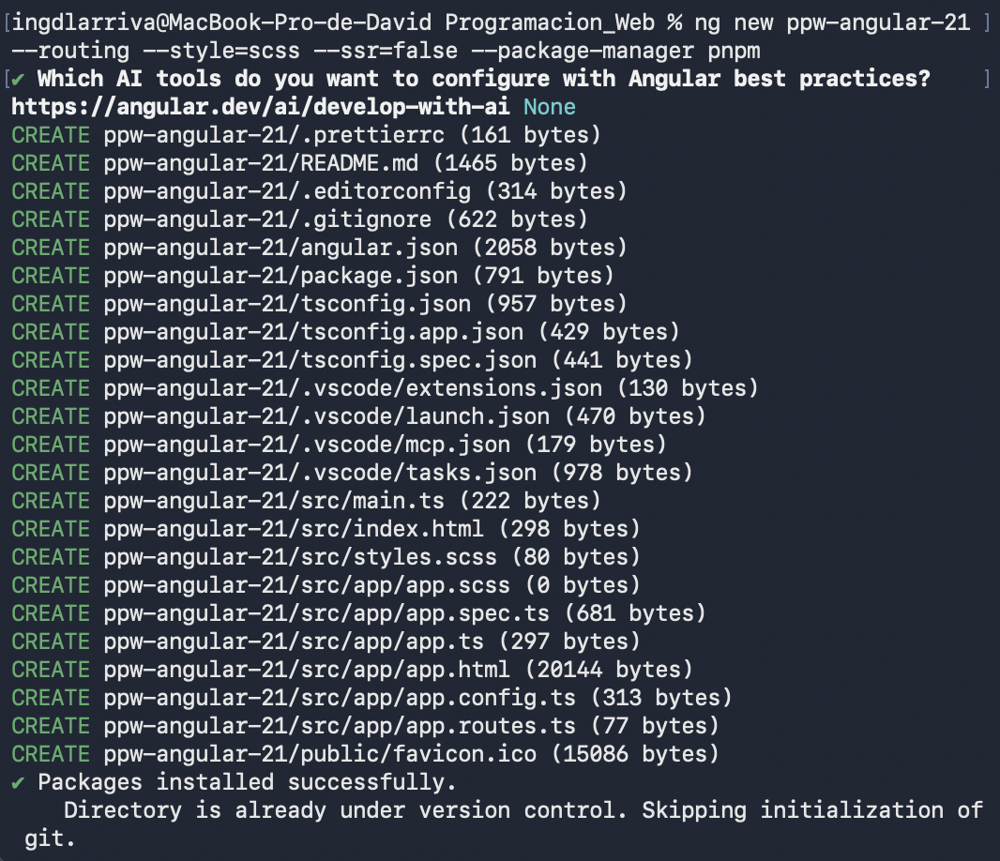
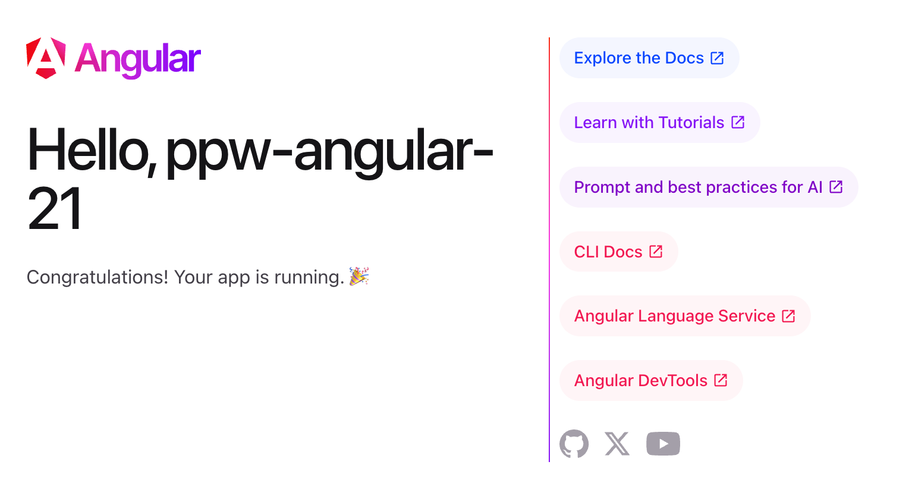
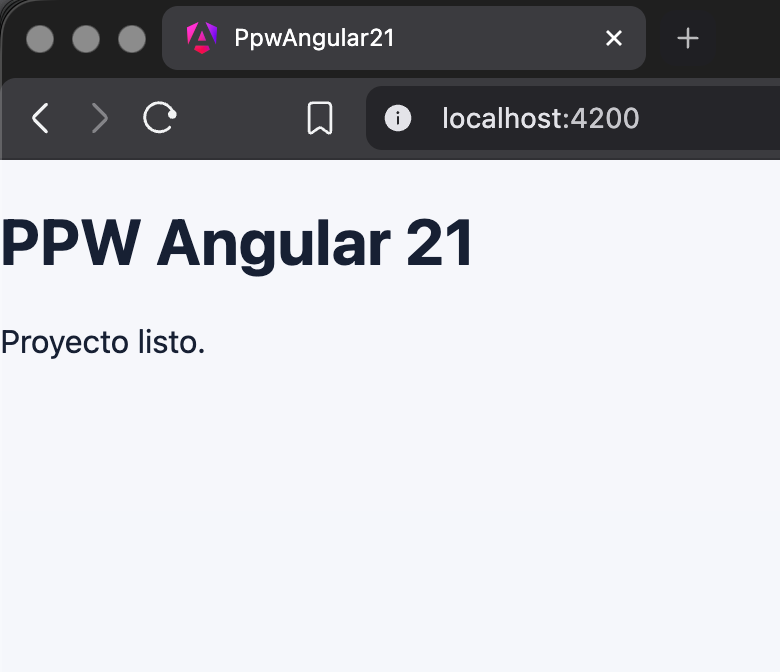

# Práctica 01: Instalación y Configuración del Entorno Angular

**Autor:** David Alejandro Larriva Castillo
**Institución:** Universidad Politécnica Salesiana (UPS)

## Propósito del Proyecto
Este repositorio contiene el proyecto incremental `ppw-angular-21` creado con Angular 21, con el sistema de rutas (`routing`) habilitado y configurado sin Server-Side Rendering (`ssr=false`). El objetivo principal de esta práctica es establecer una estructura inicial limpia, escalable y mantenible basada en características (`features`).

## Estructura Inicial
Se ha implementado una arquitectura base enfocada en la escalabilidad:
- Creación de la carpeta `features/home/pages/` para aislar los componentes de la página de inicio.
- Configuración de un enrutador global con una ruta raíz (`''`) y una ruta comodín (`'**'`) para redirecciones seguras.
- Limpieza del componente raíz (`app.component`) dejando únicamente el `<router-outlet />`.
- Configuración de estilos globales básicos.

## Evidencias
Las capturas de pantalla que validan la correcta ejecución de los comandos se encuentran alojadas en el directorio `evidencias/assets/`:

**1. Salida de ng version en la terminal:**

**2. Proceso de creación del proyecto con Angular CLI:**

**3. Página de bienvenida de Angular antes de modificar:**

**4. HomePage funcionando en localhost:4200:**

## Instrucciones de Ejecución
Para arrancar el servidor de desarrollo local, ejecuta los siguientes comandos en la terminal utilizando `pnpm`:

    pnpm install
    pnpm start